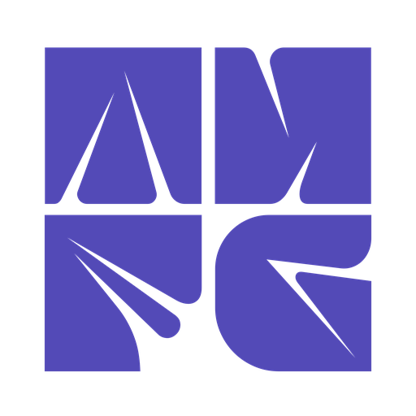

---
Task ID: 1
Agent: main
Task: Update README.md to reflect all new upgrades, fix links, remove Z logo, enhance visual experience

Work Log:
- Explored full project structure via agent (files, directories, components)
- Read current README.md (693 lines) to understand existing content
- Read key component files: homepage.tsx, layout.tsx, ThesisDiff.tsx, thesisMemory.ts, compilation-simulator.ts, robots.ts, sitemap.ts
- Identified Z logo issue: public/logo.svg contained a Z letterform SVG, referenced in README header as  — completely unused in the application
- Identified incorrect links: README had thesisforge.vercel.app but actual deployed URL is thesisforge-web.vercel.app (confirmed from layout.tsx, robots.ts, sitemap.ts)
- Identified missing features not documented: Compilation Simulator (4-pass), Thesis Memory System (10 insight rules), ThesisDiff version comparison, Writing Coach, Semantic Graph, SEO infrastructure (JSON-LD, OG image, hreflang, sitemap), Content pages (blog, templates, citation styles, VS comparisons)
- Wrote comprehensive enhanced README with all fixes

Stage Summary:
- Removed Z logo from README header (replaced with clean text-only header with badges)
- Fixed all links from thesisforge.vercel.app to thesisforge-web.vercel.app
- Added Live Demo & Links section with all 12 URLs
- Added new sections: Compilation Simulator, Thesis Memory System, Writing Coach, Version Comparison & Diff, SEO Infrastructure, Content Pages
- Enhanced visual experience with centered header, tech stack badges, improved table formatting
- Documented all 10 thesis memory insight rules, 4-pass compilation simulator architecture, 14-page sitemap, 3 JSON-LD schemas
- Updated architecture overview with new files and directories
- Updated project structure to reflect current state
- Added contributing guidelines for memory events and design tokens
- Total README expanded from 693 lines to comprehensive documentation
